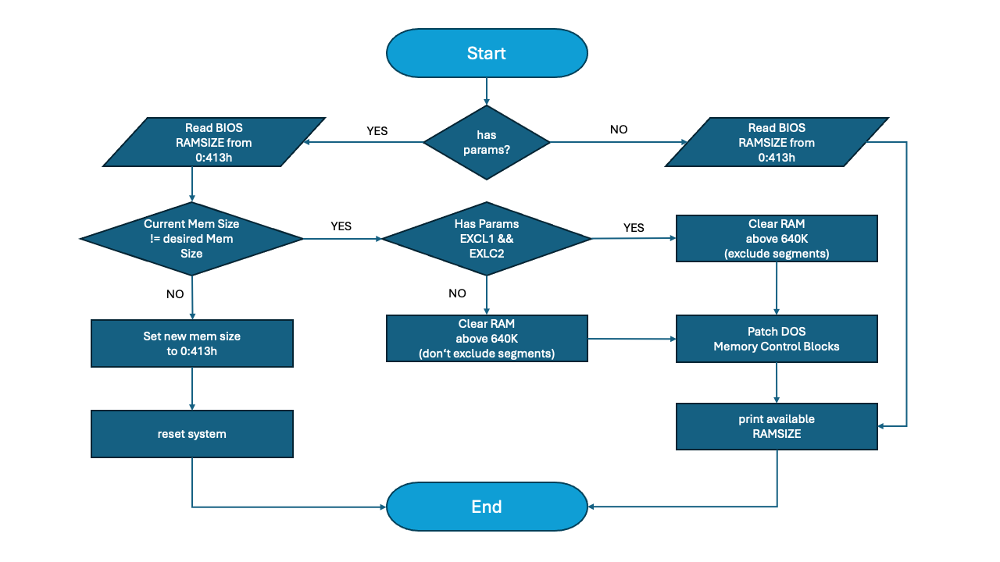
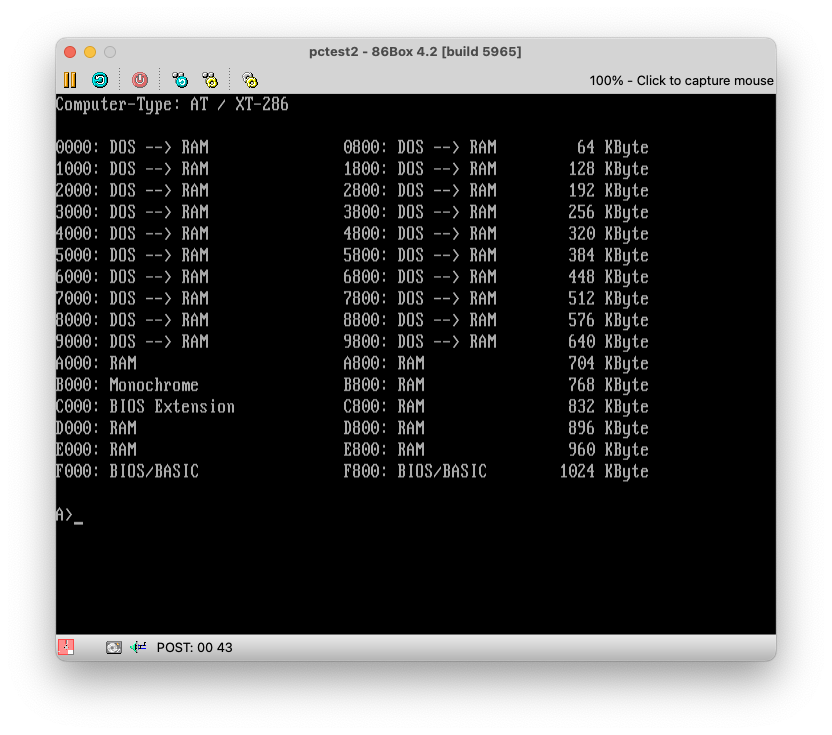
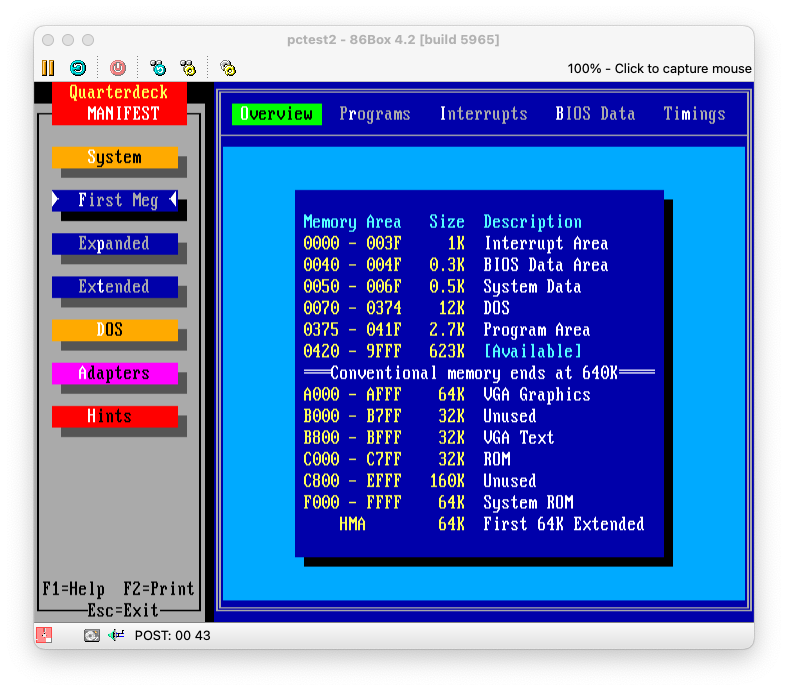
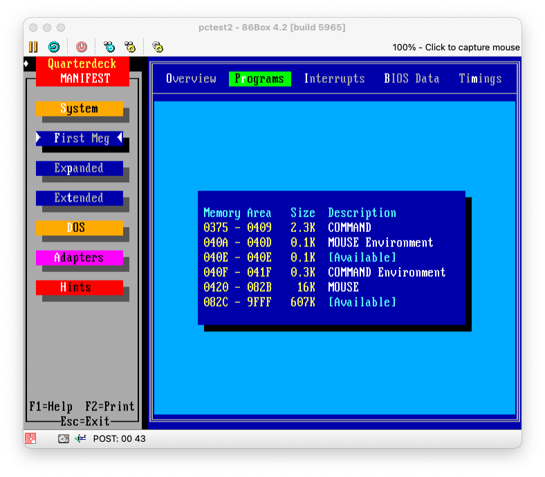
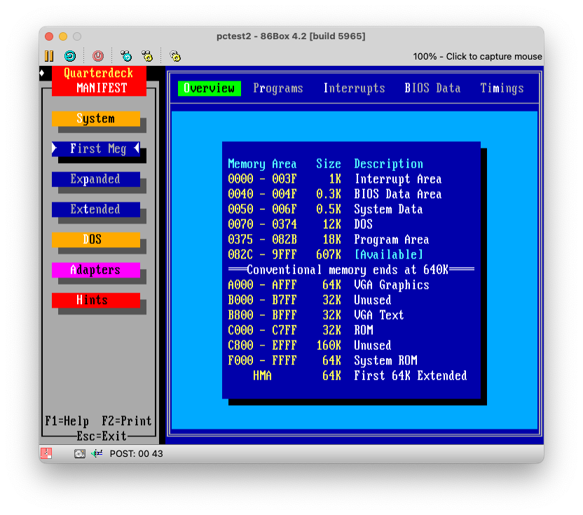
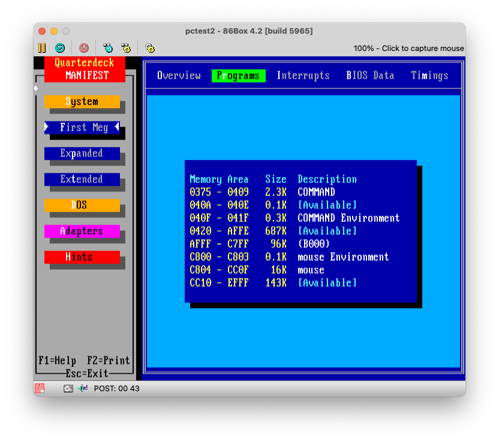
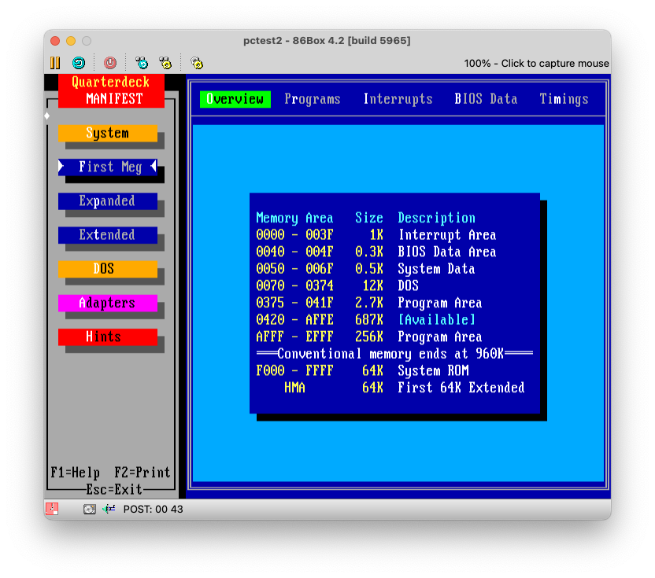
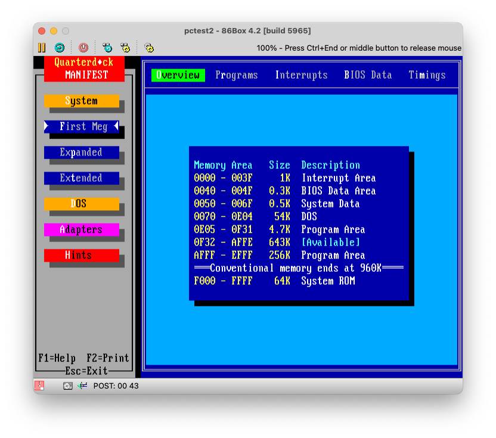

# About "Jenseits" ("beyond")

"Jenseits" ("beyond") were a series of essays published by german c't IT magazin in 1988
about extending the DOS conventional memory into the upper memory region.

Hey, that's UMBs, right?
No, absolutely not.

UMBs required for the most a memory manager like EMM386, QEMM, or others, and a 386 or better CPU.

The technique described by c't was very specific about using a RAM expansion, to fill the memory
between 640K and 1024K, and remap the available segments, so to speak, the ones not blocked by 
the graphics adapters, disk controller ROMs or the System ROM, into the conventional memory space.

I furtherly explored this in an explanatory [video](https://www.youtube.com/watch?v=Nbw5klso-VY) on my YT channel.


## Extending The Conventional Memory

That's what the `confram` utility does.

It takes three parameters:

```
confram MemSegTo [ExclusionStart-ExclusionEnd]
```

where

```
  MemSegTo        is the highest memory address you want to include as an extension
  ExclusionStart  is the first memory address to exclude (most notably: the video adapter area)
  ExclusionEnd    is the end of the memory segment to exclude
```

`confram` is best run from AUTOEXEC.BAT with the same set of arguments.

A typical example might look like this to include all memory up to address `EFFF` (= 960K),
but exclude the typical video adapter area `A000-C800`.

```
confram EFFF A000-C800
```

This would extended the conventional memory to 960K, but blend out 160K from being reserved,
leaving you with a total of 800K conventional memory available to DOS.

But beware, first you must perform a memory readout using the `sysmap` utility to understand,
which memory regions can be used!




## Memory Readout (sysmap)

The `sysmap` utility is a helper program, which performs a readout of your memory configuration.

To be honest, I found it to be not very reliable, and ended up using Quarterdeck's `mft` "manifest" utility instead,
as `sysmap` sometimes didn't properly detect the potentially available RAM segments.

Here's what a typical output looks like:



And here's the same machine using the `mft` utility:



And as you see at the example above, `sysmap` would report you the `A000-AFFF` region free to use,
whereas `mft` tells you it's the VGA region.

You can of course declare it as RAM, but that would disallow you from using any kind of graphics mode applications.


## Loading TSRs "high" with "jenseits" ("beyond")

Ok, here we get a bit unprecise.
`confram` extendes into the UMBs, but the memory made available is actually conventional memory.

Still, the memory is fragmented, and the additional memory is maybe not big enough to run one single program.
The main concern is the largest contiguous memory area.

Let's look at the `mft` output again, which shows us the different of the largest memory block with
`confram` in place, but the mouse driver loaded into low memory:





And here the same with `confram` amd the mouse driver loaded above 640k using the `beyond` utility:





Coming from this, when loading your TSRs, like the mouse driver in the example, it would by default load into the next available segment.
In our example, it would decrease the size of the availabe free memory segment by around 16k.

This would limit your ability to start programs, as everything would still use up the conventional below 640K.
Technically, even if you have more memory available, it wouldn't help, as a program must load into a single contiguous memory region.
Fragmented memory areas don't work.

This is where the `jenseits` (`beyond`) utility comes in:

```
beyond  drive:\path\to\tsr.[exe|com] [args-to-tsr]
```

e.g.:

```
beyond c:\mouse\mouse.com
```

What `jenseits` (`beyond`) is this: It temporarily consumes all memory available below 640K, and runs the given TSRs.
As all memory below 640k is occupied, it has no other way than loading into the next free available segments above 640K.

It thereafter frees up the memory below 640K.

## Technique Explained

So in a way, this is similar in behaviour, but not in technology, how memory managers like EMM386 and
the more recent DOS functions like `DEVICEHIGH` and `LOADHIGH` are working, with just one difference:

This works on 8088 and 8086 machines without MMU present, all you need is a RAM expansion to fill in the
memory area between 640k to 1024K.

You don't need `HIMEM` or `EMM386`, which wouldn't run anyway on 8088 and 8086 machines.
And, it works with MS-DOS/PC-DOS 3.0 upwards, which, by definition, didn't have the `LOADHIGH` and `DEVICEHIGH` commands yet.

What happens behind the scenes is that the `confram` utility overrides the BIOS memory address `0:413h`
with a new memory sizes, and performs a warm reboot.

Most machines won't revert the memory size upon a warm reboot, which allows `confram` on the second reboot to readout the
memory size, and perform some in-memory patching of the DOS memory control blocks to use the newly available RAM.

## Maxing out with a 286

The technique also works on 286 or later systems, although there's not much point in using it on any 386 or above,
as there you can use EMM386 et all.

But if you run a 286 system in combination with MS/PC DOS 5, which has `HIMEM.SYS` and supports relocating the DOS kernel
into the High Memory Area (HMA), then you can combine the both techniques to max out the DOS conventional memory to the max!

Put that into `CONFIG.SYS`:

```
DOS=HIGH
device=C:\DOS\HIMEM.SYS
```

And this into `AUTOEXEC.BAT` (assuming this matches our RAM segments as reported by `sysmap` or `mft`):

```
CONFRAM EFFF A000-C800
```

Running DOS 5 with `HIMEM` and `confram` would give a conventional memory outline like this when DOS is loaded high:


Compare that against DOS 5 without `HIMEM`, but `confram`, and DOS loaded low:




## Compatibility and Limitations

I didn't go into long runs of testing outside MS/PC DOS, but a quick test on DR DOS 6 showed, it wouldn't run.
Further investigation is needed, including other DOS distributions, be it PTS and Paragon DOS and FreeDOS.

Furtherly, the `confram` utility is not very sophisticated, as it only supports one exclusion range at the time.
It can be extended to have multiple regions covered, which whould maximize the amount of usable conventional memory. 


## The Code

The code available in this repository was reconstructed from the digital scans of these issues of the german IT magazine [c't](https://www.heise.de/ct).

For purposes of historical documentation and preservation, excerpts from the PDF scans are provided in this [repository](./ct).

I provide both the unaltered *german* copy of the [source files](./src/de) and x[precompiled binaries](./bin/de),
as well as *english* [translated sources](./src/en) and [binaries](./bin/en).

No further change was applied to the english copies apart from the translation,
which overs some code segments, annotations and comments, function names.

That also means, any bugs and issues, which may be present in the code, have decidedly not been corrected for.
This is provided *as is*, exactly the way it was published by *c't* in 1988.

You'll find further annotations on the source and how to build it in the [src](./src) directory.


## Attributions and Copyright

I retain no copyright of the original *c't* publications, these are Copyright (c) 1988 by Heise Zeitschriften Verlag GmbH & Co. KG.

`jenseits` and `confram` are Copyright (c) 1988 by Ralf Preller.

`sysmap` doesn't have a Copyright attribution, but I guess it's Copyright (c) 1988 of either Peter Köhlmann, Gerhard Rubel, or Michael Wilde, or Heise Zeitschriften Verlag GmbH & Co. KG.


